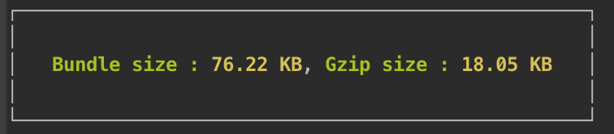

# rollup-plugin-filesize

> A rollup plugin to show filesize in the cli



## Installation

```
npm install rollup-plugin-filesize
```

## Usage

```js
import { rollup } from 'rollup';
import filesize from 'rollup-plugin-filesize';

rollup({
  entry: 'main.js',
  plugins: [
    filesize()
  ]
}).then(...)
```

## options

#### format
type : `object`

default : {}

See the options [here](https://github.com/avoidwork/filesize.js)

#### render
type : `function`

return the command that you want to log. Eg:

```js
filesize({
	render : function (options, size){
		return size;
	}
})
```

#### theme
type: `string`

default : 'dark'

options : 'dark'/'light'

choose based on your terminal theme.


## License
MIT

